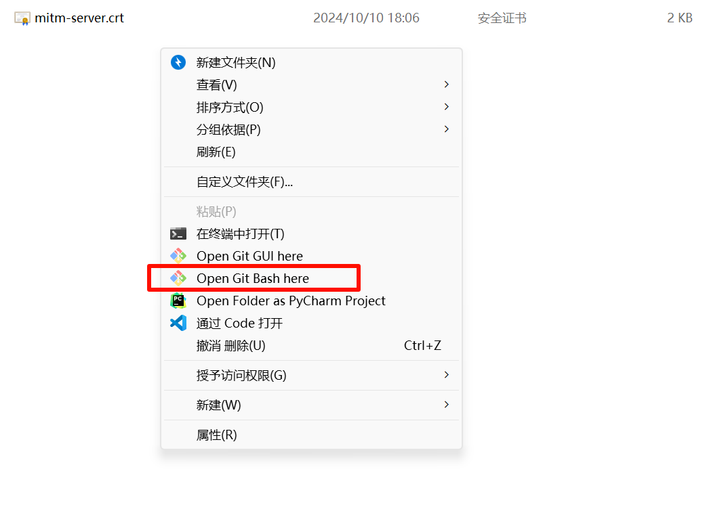
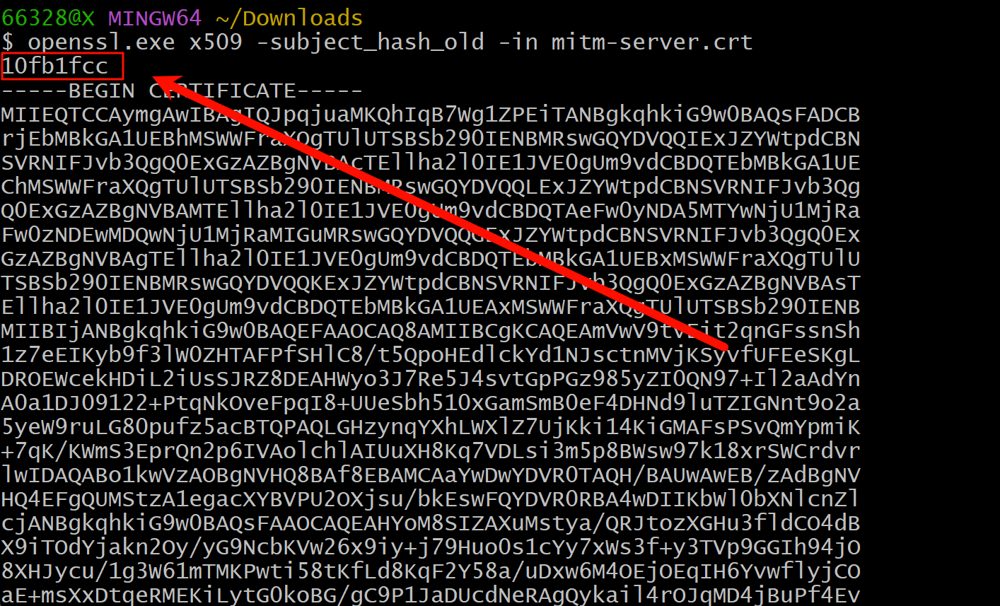
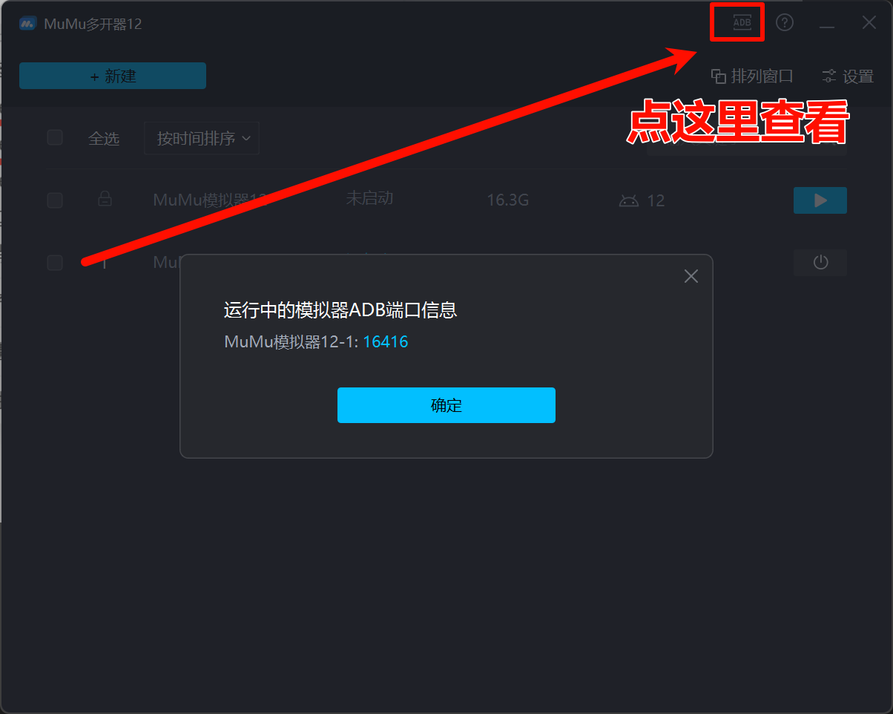
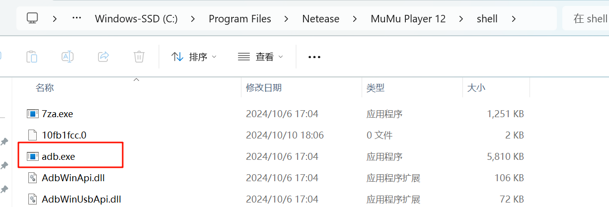
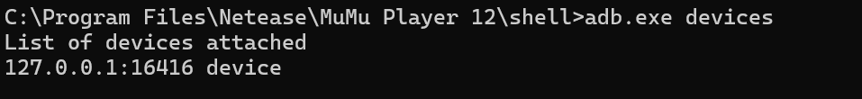
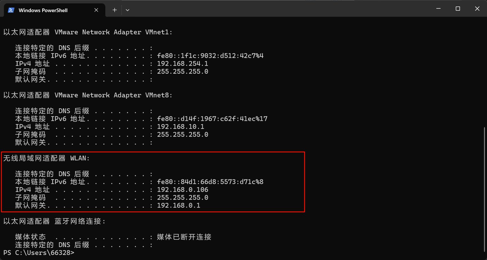
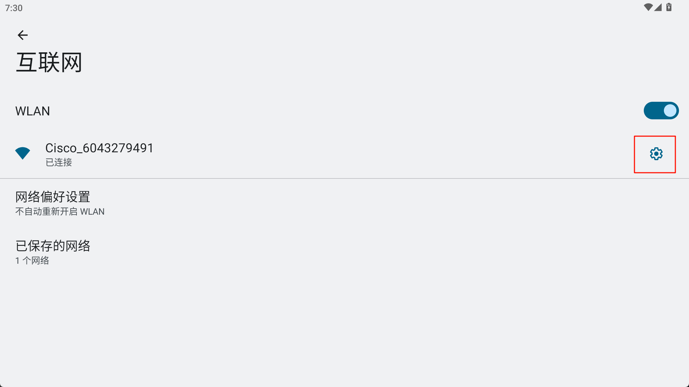
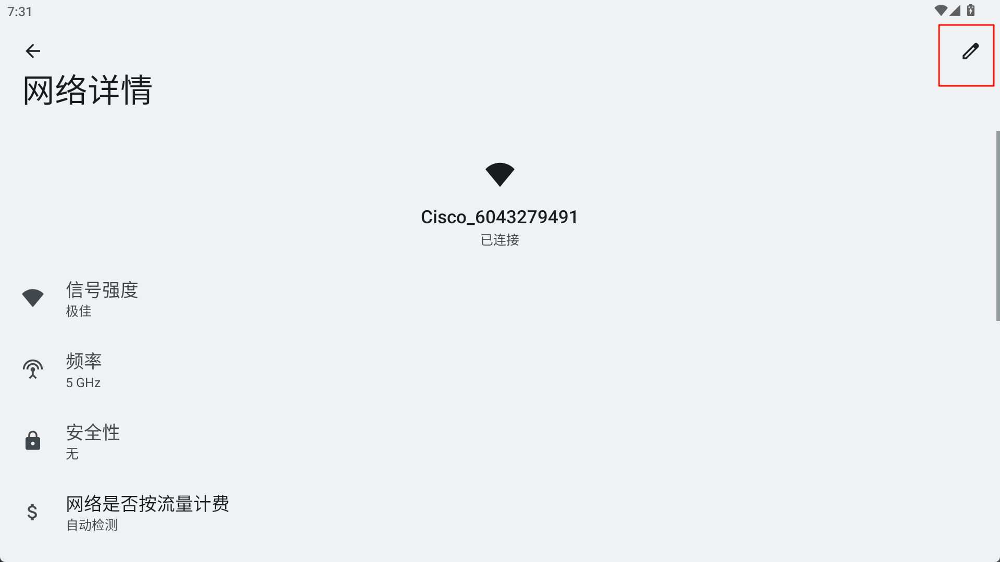
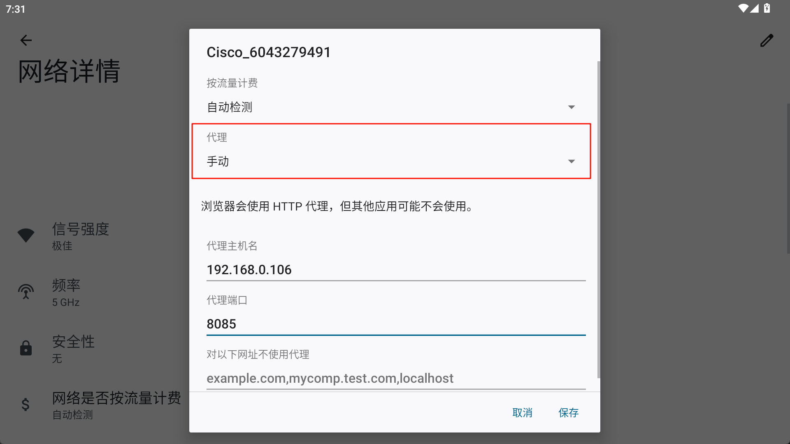
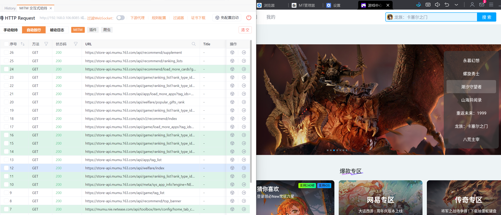

# mumu模拟器配置https证书

使用mumu12模拟器对APP进行抓包，配置HTTPS证书的过程。


# 前言

准备学习app抓包，但是被配置证书难倒了，网上虽然一搜一大堆教程，但是跟着做下来总是缺胳膊少腿的。

并且他们的环境也跟我不一样，一些都过时好久了
所以详细记录一下我解决的过程，万一哪天需要重新配置环境，我可以爪巴过来一键复制。

后期补充：
原来mumu模拟器有官方教程啊，那没事了。
来到这里的小伙伴可以去看官方教程
mumu模拟器如何配置https证书(https://mumu.163.com/help/20221018/35047_1047210.html)

本人使用的环境：

* yakit最新版（抓包工具，各位用自己顺手的就行）
* mumu12最新版 （以下模拟器相关操作均为mumu12的操作，虽然其他大差不差，但是不能照着复制，有些操作得去相关的模拟器ADB开发手册里看看）


还有一件事！

不要开桥接模式！

​​

虽然不会影响啥，但是这里不会讲开了桥接模式之后的操作。（其实也就IP换一下就行）

# 准备工作

模拟器开root与写入

# 下载/导出证书

yakit可以先开启抓包，然后访问

```cmd
http://mitm
```

下载证书，直接在软件里下载也没啥关系。

​​

# 修改证书名与后缀

下载好之后，在证书所在的文件夹打开bash窗口

如果没有的话可以下载一个git，或者把他传进linux系统中进行这些操作，我这里只讲windows里的操作（命令是一样的），毕竟方便

```cmd
# git下载链接：
https://git-scm.com/downloads/win
# 如果没有bash命令行去这里下载
```

​​

打开命令行后，在bash终端中输入命令：

```cmd
openssl.exe x509 -subject_hash_old -in mitm-server.crt
# 注意 mitm-server.crt 是刚刚导出的文件名
# 后缀叫啥也无所谓，只要是导出的证书，无论是crt还是crt.pem都无所谓（因为yakit两种导出方式导出的证书后缀不同）
```

之后你会得到如下结果：

​​

只需要记住最上面那个8位数字就行了，复制他

然后将证书文件改名成为：

```cmd
10fb1fcc.0
# 刚刚复制的8位数字.后缀名"0" , 这里的 "0" 是阿拉伯数字 "0"
```

​​

我这里是复制了一份原文件改名（算是多余操作）

# 传入mumu模拟器中

先在mumu多开器中查看一下当前运行的ADB端口

​​

进入mumu模拟器的安装目录中

​​

找到这个adb.exe文件所在的位置就行，为了方便操作，把刚刚改名后的证书文件一起复制过来。

在这个目录中打开cmd窗口

依次输入以下命令：

```cmd
adb connect 127.0.0.1:16416
# 连接到adb,注意端口为你自己的端口
adb devices
# 查看当前连接的设备
```

然后你可以看到已连接的设备，如果没有那赶紧去排查错误：

​​

```cmd
adb root
# 提升到root权限
# 输入完这个命令之后，模拟器里会弹窗，询问你是否给予root权限，记的手动切过去点允许
```

```cmd
adb shell
# 进入shell模式
```
```cmd
mount -o remount,rw /system
# 重新挂载系统目录，以便写入证书
```
```cmd
exit
# 退出shell模式
```
```cmd
adb push <你证书的名字> /etc/security/cacerts/
# 上传证书到证书目录中
# 前面把改名后的证书复制到ADB所在目录方便的就是这一步,不需要写绝对路径了
```
```cmd
adb shell chmod 644 /etc/security/cacerts/<你证书的名字>
# 给证书文件添加权限
```


OK了，到这里就结束啦，证书导入完成了。

如果不会抓包的可以往下面继续看

# 配置抓包代理

首先，在你的电脑上打开随便一个命令行窗口

```cmd
ipconfig
```

查看你的，访问互联网的网卡的，IP地址

​​

例如我这里，是`192.168.0.106`​

* 抓包工具配置

IP地址填写网卡的IP，端口随意

​​

* 模拟器配置

模拟器来到wifi设置中

​​

跟着红框点击

​​

改成手动代理，IP填写为你网卡的IP，端口填写为抓包工具监听的端口

​​

‍

配置好之后，抓包工具开启抓包，就彳亍了：

​​

‍
